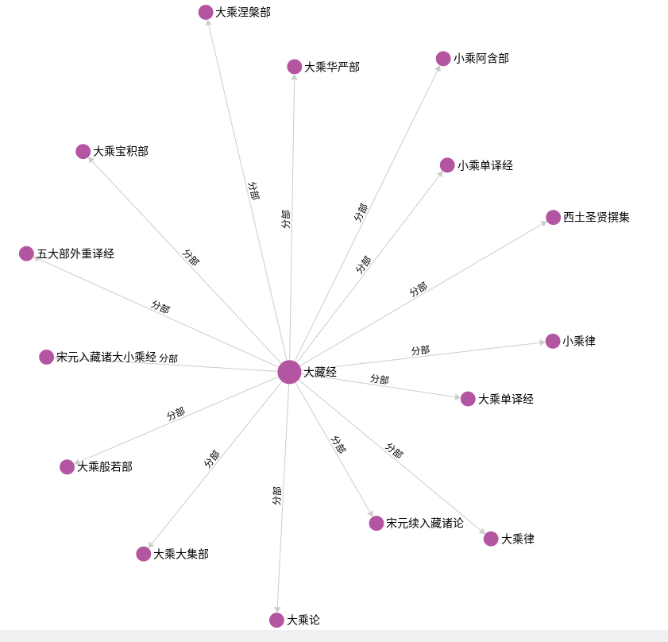

| 图谱 | 状态 | 说明 |
| :----: | :-----: | :----: |
| 大藏经 | 支持 |  |
| 人物图谱 |  | 人物图谱与经典图谱按参会与否， 谈及与否，是主题与否 |
| 经典图谱 |  |  |
| 法会图谱（法会缘由等信息） |  |  |
| 事件图谱（什么会上发生什么事） |  |  |
| 法门图谱 |  |  |
| 梵语知识 |  |  |
| 梵汉对译图谱 |  |  |
|  |  |  |

数据来源：[http://bskk.net](http://bskk.net])

spider:数据采集，保存为excel
graph_builder:从保存的excel转换成json,上传到arangodb

- 人物图谱按佛，菩萨，罗汉，长者等分开

- 关系按实际关系

- 关系挖掘

- 经典按出现

大藏经图谱结构：

分词

词性标注

意图识别

实体链接

子图匹配

推理

展示

目前功能：按difflib给出的相似度返回query相关的经典信息

- 服务：

运行 KBQA/server/server.py

返回json